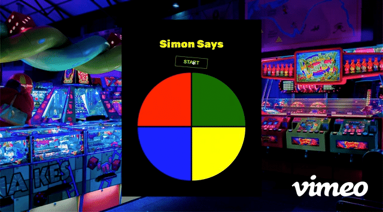

# Web Development Certificate Capstone: Simon Says

You've been hired as an intern at Thinkful Game Studio. The studio has decided to create a Simon Says game. You will be applying all the HTML, CSS, and JavaScript skills that you've learned to help them build this game.

Simon Says is a game that displays a series of tones and lights in random order and requires a player to repeat the sequence from memory. The game typically displays four colored pads. Each pad produces a particular tone when it is pressed. The tone helps the player remember the sequence. With each additional round, the number of pads in the sequence increases by one. Once the player makes a mistake, the game ends and resets.

For this project, you will build a web-based Simon Says game that can be played solo. The game designers have provided some source code, but it still needs to be completed. You are encouraged to come up with an original visual design for this game or even change the theme.



## Steps to complete

To complete this project, you must do the following:

- Write code that passes all of the requirements in the project rubric, and submit your GitHub link to the Thinkful team.

## Installation

First, fork and clone the [starter code](https://github.com/Thinkful-Ed/js-dev-final-capstone-starter-simon-says) to your local machine. If you need a refresher on how to fork and clone a project, you can review the *Forking and cloning* lesson in the *Git and GitHub* module.

From your terminal, navigate to the project directory.

Then open the project folder with the VSCode editor, and open the `index.html` file with VSCode Live Server. If you need a refresher on how to use VSCode, you can review the *Visual Studio Code* lesson in the *Developer workflow* module.

In the root of your project, run `npm install` to install the project dependencies. 

Test are split up by user story. You can run the tests for a given user story by running `npm run test:X`, where `X` is the user story number.

Have a look at the following examples:

- `npm test` runs all the tests across all user stories.
- `npm run test:1` runs all the tests for user story 1.
- `npm run test:2` runs all the tests for user story 2.
- `npm run test:3` runs all the tests for user story 3.
- `npm run test:4` runs all the tests for user story 4.
- `npm run test:5` runs all the tests for user story 5.

_**Note:** You can use the tests as a guide during the implementation of the game, but they don't have to all pass before you can submit your work, as long as your project meets the general requirements specified in the project rubric._

When you finish this project, you will need to submit a GitHub link to your project to the Thinkful team. 

# Existing files

|Folder/file path	|Description|
|------|-----|
| `index.html` |	The HTML document containing the game structure. You **are required** to edit this file so that the tests pass. |
| `src/styles.css` |	The CSS file containing the styling of the game. You **aren't required** to edit this file for the tests to pass, but you **may want** to make optional changes to the file to customize the appearance of the game.|
| `src/index.js` | The JS file containing the functionality of the game. You **are required** to edit this file for the tests to pass. |
| `test/solution.test.js` | The file containing the unit tests of the game. You **aren't required** need to edit this file.|


# User stories

The user stories presented below are short descriptions of the features that the game should have, told from the perspective of the game designer. Your work should meet the functionality as described in the *acceptance criteria* of each user story.

Each of the user stories is listed below. The user stories are to be implemented in the order in which they are listed. Find the *TODO* comments in the code and create the necessary functionality. 

Try to implement the functionality by yourself. If you get stuck, you can check the hints and REPLs that are provided.

Good luck—you can do this!

## US-01: Basic game structure

The game needs to have the basic structure for it to function, including the following:
- A name for the game
- A start button 
- A status message
- Four colored pads

The starter code is provided for you. For this user story, you will complete the starter code to implement the rest of the basic game structure.

### US-01: Add a title to the game, surrounded in `<h1>` tags

You need to name your game. The default is `Simon Says`, but you can choose another name depending on the theme that you want to set for the game. In the `index.html` file, surround your title in `<h1>` tags. 

Besides naming your game, you will also need to assign a `class` attribute to the `<h1>` tag and set the `class` attribute's value to a string of `"js-heading"` for the test to pass. It should look something like this:

```html
<h1 class="js-heading"> My game!!</h1>
```

**Tip:** By convention, any HTML class selector that contains the `js-` prefix means that the class will be used to target the element in the JavaScript file. It won't be used in the CSS file.

### US-01: Define a `start` button in `index.html`

The game needs a start button so that a player can start playing the game. Create a `button` tag and set its class attribute to `"start-button"` and `"js-start-button"`, like this:

```html
 <button class="start-button js-start-button">start</button>
```

_**Note:** `"start-button"` will be used in the CSS file to target the element for styling, whereas `"js-start-button"` will be used in the JavaScript file to target the element for adding event listeners._

In `src/styles.css`, check out the styles that have already been added for the `start-button` class. You may also customize the styling to your liking if you wish, but this isn't a requirement.

### US-01: Add pads to the grid in `index.html`

The `index.html` file only has a single pad defined. The game should have four pads defined. Add the missing pads to the HTML file.

```html
    <section class="pad-container unclickable js-pad-container">
        <div class="pad pad-red js-pad-red" data-color="red"></div>
        <!--TODO: Add the missing pads -->
      </section>
```

Check out the styles that have already been added for the `pad-container`, `pad`, `pad-red`, `pad-blue`, `pad-green`, and `pad-yellow` classes in `src/styles.css`. 

You may also customize the styling to your liking if you wish, but this isn't a requirement.

### US-01: Use `querySelector()` to access the elements in `index.js`

Great! You have defined most of the HTML structure! Now you need to make sure that you can access the elements in JavaScript. Go to `src/index.js` and take some time to analyze the query selectors. You should see something like this:

```js
/**
 * DOM SELECTORS
 */

const startButton = document.querySelector(".js-start-button");
// TODO: Add the missing query selectors:
const statusSpan; // Use querySelector() to get the status element
const heading; // Use querySelector() to get the heading element
const padContainer; // Use querySelector() to get the heading element
```

Use `querySelector()` to get the status, heading, and pad container elements.

**Hint:** Review the _Selecting elements from the DOM_ lesson from the _JavaScript and the DOM_ module if you don't remember how to use query selectors. You can also consult the [MDN Docs](https://developer.mozilla.org/en-US/docs/Web/API/Document/querySelector).

### US-01: Create objects containing data for the green, blue, and yellow pads in `index.js`

Because the game has four pads, store the data related to each pad inside an object for easy access, and collect the pad objects into a `pads` array. Later on, you will use this array to access information about each pad (such as color, DOM selector, and audio file). 

```js
const pads = [
  {
    color: "red",
    selector: document.querySelector(".js-pad-red"),
    sound: new Audio("../assets/simon-says-sound-1.mp3"),
  },
  // TODO: Add the objects for the green, blue, and yellow pads. Use the object defined for the red pad above as an example.
];
```

The built-in [`Audio()` constructor](https://developer.mozilla.org/en-US/docs/Web/API/HTMLAudioElement/Audio) creates and returns a new `HTMLAudioElement`, which can be used in a script to interact with, manage, and play audio. The URL of the audio file is passed as an argument to the `Audio()` constructor.

The URLs for the other sound files are provided in the JavaScript file.

### Acceptance criteria

1. The title is surrounded by `<h1>` tags and has `js-heading` set as the class.
2. Four pads are declared in the HTML file as `<div>` elements.
3. A start button is defined in the HTML file.
4. The missing query selectors for the status, heading, and pad container elements were added in the `src/index.js` file.
5. The `pads` array defined in the `src/index.js` file contains four pad objects.

## US-02: Initialize game

Good job! You have the HTML of your game all set up. Now, it's time to implement some of the game functionality in JavaScript.

In this user story, you will implement the game flow so that the player can press the start button to initialize the game.

### US-02: Implement `setLevel()`

`setLevel()` sets the level of the game given a `level` parameter. If no argument is passed while calling the function, `level` defaults to `1`. Acceptable values for `level` are `1`, `2`, `3` or `4`. An error message should be returned for invalid parameter values.

Use the pseudocode in `src/index.js` as a guide for your implementation.

```js
function setLevel(level = 1) {
  // TODO: Write your code here.
}
```

### US-02: Implement `startButtonHandler()`

`startButtonHandler()` initializes the game by setting the number of rounds needed to win the game, updating the game interface, and calling `playComputerTurn()`, which prompts the computer to begin building a sequence for the game. 

Use the pseudocode in `src/index.js` as a guide for your implementation. 

```js
function startButtonHandler() {
  // TODO: Write your code here.
}
```

**Hint:** In the *JavaScript and the DOM: Selecting elements* lesson, you learned about the `classList()` method. Take some time to review the [classList MDN docs](https://developer.mozilla.org/en-US/docs/Web/API/Element/classList) before you proceed with implementing this function. Previously, you used `classList.add()` and `classList.remove()` to add and remove classes to HTML elements.

### US-02: Attach `startButtonHandler()` as an event listener on the start button

Attach `startButtonHandler()` as an event listener on the start button, so that `startButtonHandler()` is called whenever the start button is clicked.

```js
/**
 * EVENT LISTENERS
 */

padContainer.addEventListener("click", padHandler);
// TODO: Add an event listener `startButtonHandler()` to startButton.
```

**Hint:**  If you don't remember event handlers, you can review the _Event listeners_ lesson from the _JavaScript and the DOM_ module.

### US-02: Acceptance criteria

1. `setLevel()` works as expected, as specified in the pseudocode.
2. `startButtonHandler()` works as expected, as specified in the pseudocode.
3. `startButtonHandler()` is attached as an event listener on the start button.

## US-03: Play computer's turn

In the previous user story, you implemented some of the basic functions necessary for the game to work correctly. Congrats! You are making good progress!

In this user story, you will implement the game flow so that the computer can play its turn first after the player presses the start button. The computer will randomly select a pad to add to the game sequence, activate the pad sequence, and prompt the player to play their turn.

### US-03: Implement `getRandomItem(collection)`

`getRandomItem(collection)` returns a randomly selected item from a given array. Use the pseudocode in `src/index.js` as a guide for your implementation. 

**Note:** This function is already implemented for you. You only need to uncomment the code inside the function.

```js
function getRandomItem(collection) {
  // if (collection.length === 0) return null;
  // const randomIndex = Math.floor(Math.random() * collection.length);
  // return collection[randomIndex];
}
```

### US-03: Implement `setText(element, text)`

`setText(element, text)` sets the text content of a given HTML `element` with a given `text`. Use the pseudocode in `src/index.js` as a guide for your implementation. 

```js
function setText(element, text) {
  // TODO: Write your code here.
}
```

**Hint:** Study the [`textContent`](https://www.w3schools.com/jsreF/prop_node_textcontent.asp) property to understand how you can use it to set the text of a HTML element.

### US-03: Implement `activatePad(color)`

`activatePad(color)` activates a pad of a given color by playing its sound and lighting it up. Use the pseudocode in `src/index.js` as a guide for your implementation. 

```js
function activatePad(color) {
  // TODO: Write your code here.
}
```

**Hint:** Recall that `setTimeout()` is explained in the _JavaScript and the DOM: Events_ lesson. You can also consult the [`setTimeout()` MDN docs](https://developer.mozilla.org/en-US/docs/Web/API/setTimeout). You will be using `setTimeout()` to build other functions in the game, so it's important that you understand how it works.

### US-03: Implement `activatePads(sequence)`

`activatePads(sequence)` activates a sequence of colors, which are passed as an array to the function. Use the pseudocode in `src/index.js` as a guide for your implementation. 

```js
function activatePads(sequence) {
  // TODO: Write your code here.
}
```

### US-03: Implement `playComputerTurn()`

`playComputerTurn()` allows the computer to play its turn, which includes randomly selecting a color to add to the computer sequence and displaying the updated sequence to the player. Use the pseudocode in `src/index.js` as a guide for your implementation.

```js
function playComputerTurn() {
  // TODO: Write your code here.

  setTimeout(() => playHumanTurn(roundCount), roundCount * 600 + 1000);
}
```

### US-03: Acceptance criteria

1. `getRandomItem(collection)` works as expected, as specified in the pseudocode and returns a randomly selected element from an array.
2. `setText(element, text)` works as expected, as specified in the pseudocode.
3. `activatePad(color)` works as expected, as specified in the pseudocode, activating a pad of a given color by playing its sound and light.
4. `activatePads(sequence)` works as expected, as specified in the pseudocode, activating a series of pads
5. `playComputerTurn()` works as expected, as specified in the pseudocode.

## US-04: Play player's turn

The computer can now create and display a random sequence of pads that the player must attempt to memorize. In this user story, you will implement the game flow so that the player can play their turn after the computer has completed its turn. 

### US-04: Implement `playHumanTurn()`

`playHumanTurn()` allows the player to play their turn, which includes allowing each pad to be clickable. Use the pseudocode in `src/index.js` as a guide for your implementation. 

```js
function playHumanTurn() {
  // TODO: Write your code here.
}
```

### US-04: Implement `padHandler(event)`

`padHandler()` is called when the player presses one of the colored pads. Use the pseudocode in `src/index.js` as a guide for your implementation. 

```js
function padHandler(event) {
  const { color } = event.target.dataset;
  if (!color) return;

  // TODO: Write your code here.
}
```


### US-04: Implement `checkPress(color)`

`checkPress()` checks the player's selection every time the player presses on a pad during the player's turn. Use the pseudocode in `src/index.js` as a guide for your implementation. 

```js
function checkPress(color) {
  // TODO: Write your code here.
}
```

### US-04: Implement `checkRound()`

`checkRound()` checks each round to see if the player has completed all the rounds of the game and advances to the next round if the game isn't finished. Use the pseudocode in `src/index.js` as a guide for your implementation. 

```js
function checkRound() {
  // TODO: Write your code here.
}
```

### US-04: Acceptance criteria
 
1. `playHumanTurn()` works as expected, as specified in the pseudocode.
2. `padHandler(event)` works as expected, as specified in the pseudocode.
3. `checkPress(color)` works as expected, as specified in the pseudocode.
4. `checkRound()` works as expected, as specified in the pseudocode.

## US-05: Reset game

Now that the computer and the player can complete their respective turns, it's time to allow the game to be reset so that the player can play the game again. 

In this user story, you will implement the game flow so that the player can reset the game either if the player makes a mistake or successfully completes all the rounds of the game, so the game can be played again.

### US-05: Implement `resetGame(text)`

`resetGame(text)` resets the game by resetting the game variables and interface to their original implementations. It accepts a `text` string parameter as input, which it will display in the built-in [alert dialog](https://developer.mozilla.org/en-US/docs/Web/API/Window/alert) using `alert()`.

Use the pseudocode in `src/index.js` as a guide for your implementation. Part of the code has already been implemented for you, so you'd just have to read and understand the code and uncomment it for the function to work:

```js
function resetGame(text) {
  // TODO: Write your code here.

  // Uncomment the code below:
  // alert(text);
  // setText(heading, "Simon Says");
  // startButton.classList.remove("hidden");
  // statusSpan.classList.add("hidden");
  // padContainer.classList.add("unclickable");
}
```

### US-05: Acceptance criteria

1. `resetGame()` works as expected, as specified in the pseudocode.

## US-06: Originality

Good job in making it this far! 

You have a functional game, and it's time to add some uniqueness and originality to make it your own. Read the following suggestions and implement whatever you want. There are no unit tests for this user story, but originality will be considered in the rubric.

### 1. Change the look of the game.
The game looks great, but it looks similar to other students' games. Edit the `src/styles.css` file and make changes to make your game look unique. Here are some suggestions for elements you could change:
- The colors and shapes of the buttons (when dormant or active)
- The background image
- The fonts
- The layout of the game

### 2. Audio effects and music
Customize the game with your favorite sound effects. Here is a [REPL](https://replit.com/@thinkful/audiofx-and-music#script.js) with an example of how to add audio to your game. Feel free to use your own audio files.

For example, you can play victory music if the player successfully completes all the rounds of the game or a different kind of music if the player makes a mistake.

### 3. Additional features
You can add additional features to your game. Here are some ideas to get you started:
- Adding more user controls (such as a drop-down menu) to allow the player to select the skill level or difficulty of the game, as follows:
   - Skill level 1: 8 sequences
   - Skill level 2: 14 sequences
   - Skill level 3: 20 sequences
   - Skill level 4: 31 sequences
- Adding a two-player mode
- Adding additional animations

### US-06: Acceptance criteria

1. There are no unit tests for this user story, but originality and creativity will be considered in the rubric. Consider implementing at least one of the suggested options listed above.

## US-07: Deploying to Github

You made it! You finished the first version of your game. Now it's time to show it to your team and the game designer. Follow the instructions in the *Git and GitHub* module and deploy your game so that it becomes part of your portfolio.

### US-07: Acceptance criteria

1. Project is deployed to GitHub.

# Success criteria

Functionality:
- The game starts when a player clicks the start button.
- The computer selects the pads randomly.
- The player can select a pad when it's their turn. 
- The game ends/resets when a player makes a mistake or successfully completes all the rounds of the level.
- The game is deployed to GitHub.
- The game presents some aspects of originality and creativity, as specified in US-06.

General code organization:
- Minimal code duplication
- Comments are used to describe the functions.

# Tips

- Start by completing the required HTML elements and then proceed to work on the JavaScript functions. CSS changes can be made last. Follow the order of the user stories.
- If you get stuck, take a careful look at the resources that are provided. If you are still stuck, ask a friend or a mentor for help.
- Read the user stories and tests carefully.
